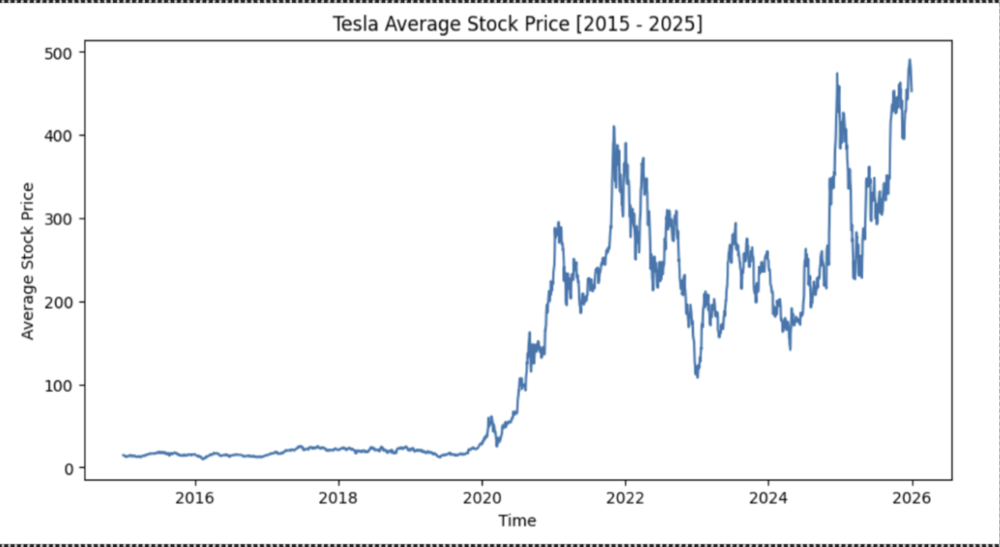
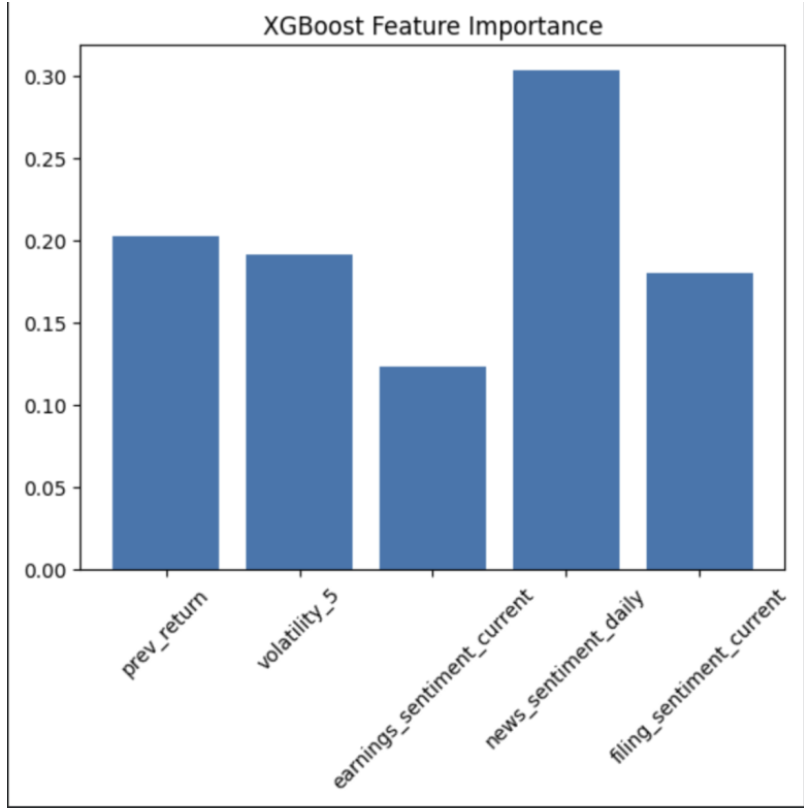
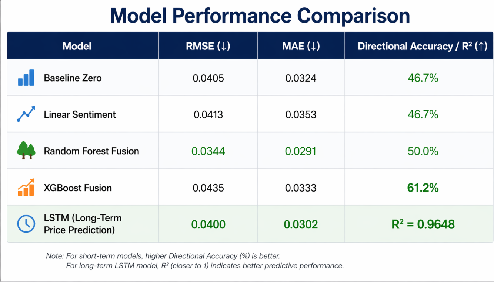
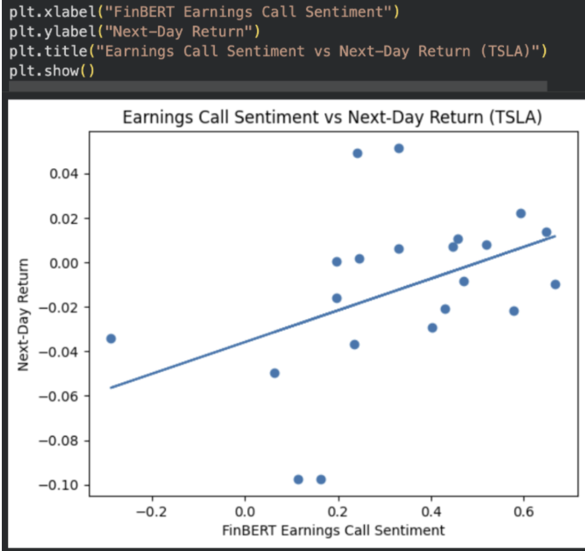
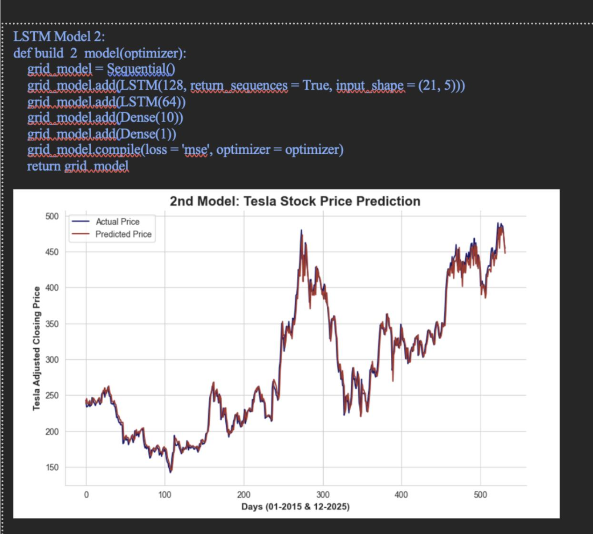

# 📈 Single Stock Prediction using Corporate Sentiment

## Project Overview

This project predicts Tesla stock movement using corporate sentiment extracted from financial text sources and machine learning models.

Sentiment analysis was performed using FinBERT and RAG-based approaches.

The project combines financial sentiment with stock market indicators to evaluate predictive performance.

---

## Data Sources

### Financial Market Data
- Tesla historical stock prices (2015–2025)

### Corporate Text Data
- Earnings Call Transcripts
- SEC Filings (10-K / 10-Q)
- Financial News

---

## Sentiment Extraction

### FinBERT

Used for:

- Earnings Calls
- Financial News

Outputs:

- Positive sentiment
- Negative sentiment
- Neutral sentiment

### RAG Pipeline

Applied to:

- SEC documents
- Corporate reports

---

## Feature Engineering

Features:

- Previous Return
- 5-Day Volatility
- Earnings Sentiment
- SEC Sentiment
- News Sentiment

Target:

- Next-day stock return prediction

---

## Machine Learning Models

- Baseline
- Random Forest
- XGBoost
- LSTM

---

## Repository Structure

stock_sentiment_prediction/

data/
- raw/
- processed/

notebooks/

src/

results/
- figures/
- tables/

models/

docs/

---

## Technologies

Python

Pandas

NumPy

Scikit-Learn

XGBoost

PyTorch

Transformers

FinBERT

Matplotlib

---

## Author

Mario Jakupas

MS Computer Science – Data Analysis

Montclair State University
---

## Project Visualizations

### Tesla Historical Stock Price (2015–2025)

### Earnings Call Sentiment Dataset

### XGBoost Feature Importance

### Model Performance Comparison

### LSTM Stock Prediction

